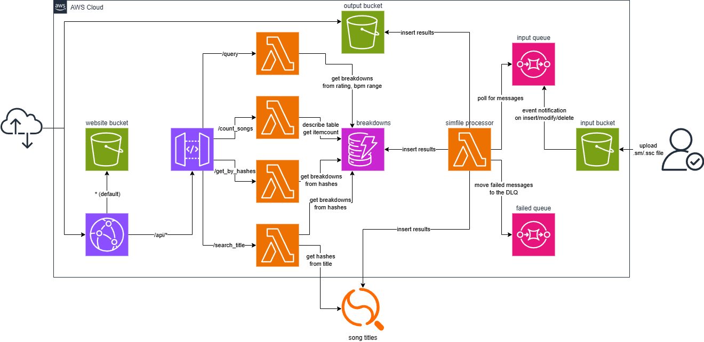

# [itg stamina database](https://d2xk0hpalqd86m.cloudfront.net/)

Demo link: https://d2xk0hpalqd86m.cloudfront.net/ -- custom domain soon™

This website is a large database of StepMania/In The Groove stamina simfiles used in tournaments such as East Coast Stamina and Stamina RPG. All data available should mainly be used as reference points for rating/assigning a difficulty meter to newer simfiles.

The following packs are available:
- East Coast Stamina 13.5
- Stamina RPG 6-9 base packs

## features

- search by rating and bpm range
  - can also include neighboring ratings
- search by song title
- pattern analysis of simfiles (how many candles, anchors, etc.)
  - inspired by [pnn64/PerfectTaste's simfile parser](https://github.com/pnn64/rssp)
- per-stream pattern analysis in addition to the whole file

## architecture

## implementation details

### 1. website hosting

Frontend is developed using **React**, and all build artifacts are stored in **S3**.

All contents in S3 are delivered using **CloudFront** with Origin Access Control (OAC).

### 2. simfile processing

An input S3 bucket takes in `.sm` or `.ssc` files that I (or someone else that has privileges) upload. Event notifications are then sent to an **SQS** standard queue.

A **Lambda** function then polls the queue for these notifications to then query the S3 bucket for the uploaded file contents and parse the data. The function then stores the detailed processed data to an output S3 bucket and simple processed data to a DynamoDB table `breakdowns`.

The chart hash and song title are also stored in an **OpenSearch** cluster that I manage myself (I'm not using AWS OpenSearch because that's too expensive. I'm using bonsai.io instead).

Repeated parsing failures are sent to a dead-letter queue.

### 3. backend

The **DynamoDB** table `breakdowns` stores the following attributes:

- `chart_hash`: string (PK) - the chart's SHA1 hash
- `rating`: number - the chart's difficulty meter
- `bpm`: number - the song's bpm

and currently stores the following extra info:
- `title`: string - the song title
- `stream_total`: number - the total number of measures that have at least 16 notes
- `stream_density`: number - number of streams / total number of measures in the song starting from the first stream
- `stream_breakdown`: string - a text-formatted version of the stream breakdown -- `stream (break) stream (break) ...`

HTTP API is created using **API Gateway** and delivered using CloudFront through the `/api/*` cache behavior.

The following endpoints are available:

- `GET /query`
  - `rating`: the chart's rating/difficulty meter
  - `bpm_from`: the lower bound of the bpm range
  - `bpm_to`: the upper bound of the bpm range
  - this is just a simple `DynamoDB:Query` operation
  - returns the chart info (song title, rating, bpm, stream total and density, breakdown) that matches the parameters

- `GET /count_songs`
  - this is just a simple `DynamoDB:DescribeTable` operation
  - returns the number of items in the table
  - known caveat: this doesn't update immediately after insert/delete (every 6 hours)

- `GET /search_title`
  - `search`: the song title (or keywords)
  - this is a two-step process: 1. query the OpenSearch cluster for chart hashes that match the `search` parameter and 2. perform a `DynamoDB:BatchGetItem` operation using the chart hashes
  - returns the chart info that matches the search

- `POST /get_by_hashes`
  - body matches the format: `{"chart_hashes": list[str]}`
  - this is mainly for unprocessed items from `GET /search_title`
  - this is just a simple `DynamoDB:BatchGetItem` operation
  - returns the chart info the matches the `chart_hashes`
  - note: this isn't implemented in the frontend yet; the table is currently small enough s.t. this isn't needed yet

### 4. infrastructure as code

All AWS resources are managed by **Terraform**. Frontend and backend resources are separated in their own modules.

### 5. ci/cd

Changes to the frontend and infrastructure are re-deployed using **GitHub Actions**.

## known bugs

hopefully fixed as of 12/13/2025 - Charts with changing bpms are not handled properly for per-stream pattern analysis because some slower streams have a note graph value lower than 16.

## possible expansions

- admin dashboard for ease-of-use file uploading and breakdown editing
- monitoring using cloudwatch for simfile processing failures, api error rates?